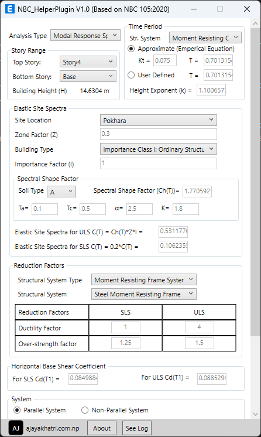
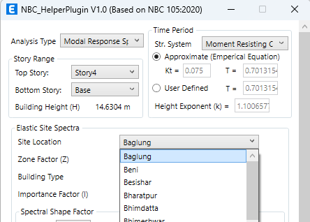
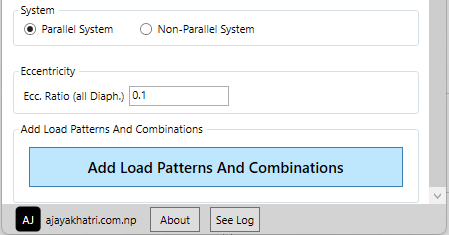
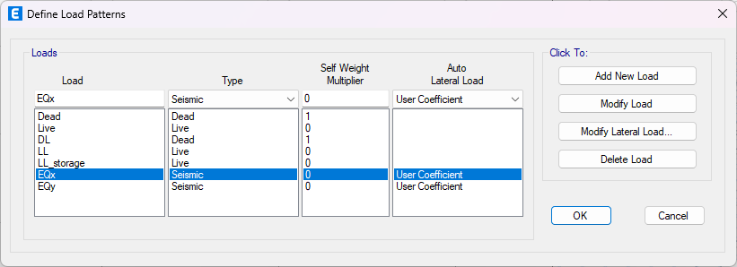
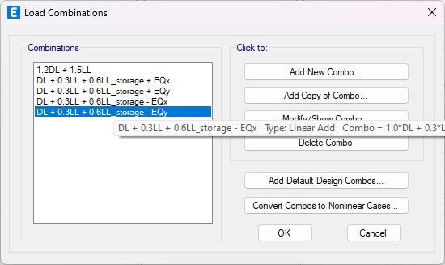

# NBC_HelperPlugin

ETABS Plugin Based on NBC 105:2020 for Load Patterns and Combinations Definition

## Description🧾

This plugin "NBC_HelperPlugin V1.0" is designed to streamline the early stages of Load Pattern and Load Combination definition, making the process more efficient. Following the guidelines outlined in Nepal National Building Code NBC 105:2020 for Seismic Design of Buildings in Nepal, the plugin calculates Base Shear Coefficients and Building Exponent required during seismic load definition. Additionally, it automatically adds essential load patterns and combinations in accordance with the NBC code.

## Usage Direction🧾

It is recommended to apply the plugin in files without preexisting load patterns or combinations, as it may disrupt existing assignments. Feel free to experiment, though! 👍

1. Change the data to your liking.

   

2. Click on **Add Load Patterns And Combinations** button.

   

3. Load Patterns and Combination will be added accordingly.

   

   

## Disclaimer ⚠️

The Plugin is provided "as is", without warranty of any kind, express or implied, including but not limited to the warranties of merchantability, fitness for a particular purpose and noninfringement. In no event shall I be liable for any claim, damages or other liability, whether in an action of contract, tort or otherwise, arising from, out of or in connection with the software or the use or other dealings in the software.
